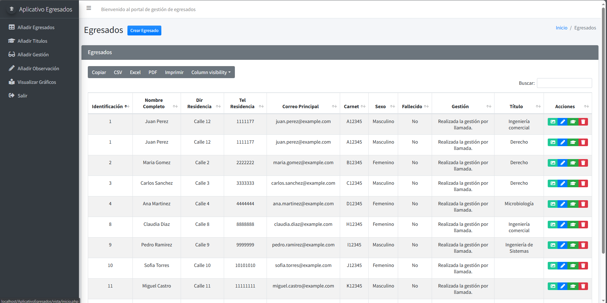

# 🎓 Sistema de Gestión de Egresados 📊


## 📜 Descripción

El **Sistema de Gestión de Egresados** es una plataforma web desarrollada para gestionar y organizar los datos de los egresados de una institución educativa. Permite realizar un seguimiento de la información personal, los títulos obtenidos, las gestiones realizadas y más. Además, ofrece funcionalidades para agregar observaciones, gestionar eventos, y generar gráficos estadísticos basados en la información almacenada.

Este proyecto está desarrollado utilizando tecnologías FullStack bajo el patrón **MVC (Modelo-Vista-Controlador)**, con **PHP** para el backend, **JavaScript** para la interacción en el frontend, y **MySQL/MariaDB** como sistema de gestión de base de datos.

---

## 🚀 Funcionalidades Principales

- ✅ **Gestión de egresados**: Registro de información personal, títulos y gestiones realizadas.
- 📝 **Observaciones**: Posibilidad de agregar observaciones a cada egresado.
- 📈 **Estadísticas**: Generación de gráficos dinámicos sobre la distribución de egresados.
- 🛠️ **Panel de administrador**: Vista interactiva para gestionar el sistema.
- 🔒 **Autenticación**: Gestión de sesiones para usuarios administradores.

---

## 🛠️ Tecnologías Utilizadas

- **PHP** para la lógica del backend.
- **JavaScript** y **jQuery** para la interacción frontend.
- **MySQL/MariaDB** para la base de datos.
- **Bootstrap** para el diseño visual.
- **HTML/CSS** para la estructura y estilos.

## 🧑‍🤝‍🧑 Contribuir

Si deseas contribuir al proyecto:

1. Realiza un fork del repositorio.
2. Crea una nueva rama (`git checkout -b feature/nueva-funcionalidad`).
3. Realiza los cambios necesarios y haz commit (`git commit -m 'Agregar nueva funcionalidad'`).
4. Sube tus cambios (`git push origin feature/nueva-funcionalidad`).
5. Crea un Pull Request en GitHub.


## 👀 Preview
Aquí una vista previa:



## 🔧 Requisitos

### 📦 Software Requerido

- 💻 **Servidor Web**: Apache o Nginx
- 🐘 **PHP 7.0** (o superior)
- 🐬 **MySQL 5.x** o **MariaDB 10.x**
- 📦 **Composer** (para manejar dependencias)
- 🗃️ **Git** (opcional, para control de versiones)

### 🔗 Extensiones PHP

Asegúrate de tener las siguientes extensiones de PHP activadas:

- `PDO_MySQL`
- `cURL`
- `mbstring`
- `json`
- `session`

---

## ⚙️ Instalación

### 1. 📥 Clonar el repositorio

```bash
git clone https://github.com/tuusuario/gestion-egresados.git
cd gestion-egresados
```
### 2. 🗄️ Configurar la base de datos
1. Crear una base de datos en MySQL/MariaDB.
2. Importar el archivo SQL de la carpeta /db:

```bash
mysql -u usuario -p nombre_base_de_datos < db/gestion_egresados.sql
```
### 3. ⚙️ Configurar el servidor local
- Si usas XAMPP o WAMP, coloca el proyecto en la carpeta htdocs o www.
- Asegúrate de que el servidor web apunta a la carpeta del proyecto.

### 4. 🚀 Ejecutar el proyecto

```bash
http://localhost/gestion-egresados

```

### 📂 Estructura del Proyecto

```
gestion-egresados/
│
├── assets/               # 📁 Archivos CSS, JavaScript, imágenes
├── controlador/          # 🎯 Controladores del MVC
├── modelo/               # 💾 Modelos del MVC (conexión y consultas a la BD)
├── vista/                # 🖼️ Vistas HTML y archivos PHP relacionados
├── db/                   # 🗄️ Archivos SQL para la base de datos
├── layouts/              # 📜 Encabezados, pies de página y menús
├── config/               # ⚙️ Archivos de configuración
└── README.md             # 📘 Este archivo
```
## 📄 Licencia
Este proyecto es gratuito.

## 📧 Contacto
Si tienes alguna pregunta o comentario, no dudes en ponerte en contacto:

- **Autor**: Tu Nombre
- **LinkedIn**: [Perfil de LinkedIn](https://www.linkedin.com/in/miguel-%C3%A1ngel-osorio-londo%C3%B1o-940218206/)
- **GitHub**: [Perfil de GitHub](https://github.com/Daijaz)
- **Correo Electrónico**: [Correo](mailto:miguelosorio1904@gmail.com)


